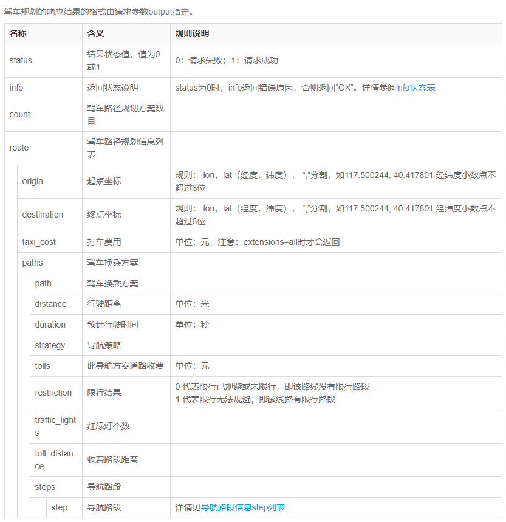
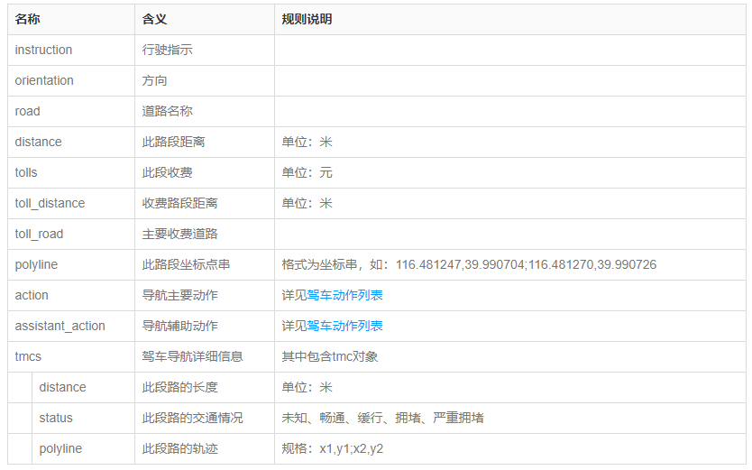

# GBA_tranportation

transportation analysis for GBA

## 时间线

- 19年4月2号 12 a.m.
  [南沙大桥](https://zh.wikipedia.org/wiki/%E5%8D%97%E6%B2%99%E5%A4%A7%E6%A1%A5)（虎门二桥）开通
- 20年5月5号 `虎门大桥振动`
  2020年5月5日14时许，虎门大桥出现较为明显的波浪形抖动现象，随后大桥双向车道及通航水域被封闭通行。综合相关桥梁专家的转述，虎门大桥出现波动原因，主要是因为在桥面设置了“水马”，改变了钢箱梁的气动外形，与虎门大桥多年来的超负荷运行无关。
- 20年5月15号 9 a.m. `虎门大桥恢复通车`
  广东省交通集团发布消息称，15日9时，虎门大桥恢复通车。[广州日报全媒体](http://www.xinhuanet.com/politics/2020-05/16/c_1125991891.htm)记者昨天现场走访看到，重新通车后的虎门大桥，路面平整，车流顺畅，悬索桥两侧采取了抑振措施，以保障大桥安全。目前，虎门大桥继续实施全天禁止货车及40座以上客车通行。
  
## 桥梁简介

- [虎门大桥](https://zh.wikipedia.org/wiki/%E8%99%8E%E9%97%A8%E5%A4%A7%E6%A1%A5)
  虎门大桥是一座位于中国广东省珠江三角洲中部、连接东莞市虎门镇和广州市南沙区的大型悬索桥，位于珠江出海口的虎门水道和蒲州水道之上，是珠江三角洲高速公路网的重要组成部分，也是连接京珠高速公路和广深高速公路的重要交通枢纽。虎门大桥及其连接线工程全长15.6公里，其中主桥全长4.6公里，桥面为双向六车道设计，于1997年6月9日建成通车。
  自虎门大桥通车后，成为香港、深圳、东莞、惠州等珠三角东岸地区往返中山、珠海、佛山（顺德等地）、江门等珠三角西岸地区的必经之路，随着珠三角城市发展，大桥通车后十年日均车流量已接近七万架次，远超设计负荷，车龙有时更伸延至广深高速公路及其他相连路段，轮候上桥时间达两小时，在节假日内地高速公路免路费的时段车龙更长，因此在坊间有了“英雄难过虎门关（桥）”的戏言.

- [南沙大桥](https://zh.wikipedia.org/wiki/%E5%8D%97%E6%B2%99%E5%A4%A7%E6%A1%A5)
  南沙大桥（规划及建设时期称为虎门二桥、虎门第二公路通道）是一座位于中国广东省珠江三角洲中部、横跨珠江的公路悬索桥，也是S6广龙高速的起始路段。本桥距上游黄埔大桥约20公里。南沙大桥跨越珠江狮子洋的大沙水道和坭洲水道，东连东莞市沙田镇，西通广州市南沙区。南沙大桥是珠江三角洲高速公路网的重要组成部分，是连接广州绕城高速公路和广深沿江高速公路的重要过江通道，也是继虎门大桥后又一条沟通珠江出海口两岸的大型跨江悬索桥。
  4月2日上午10点，虎门二桥通车仪式在虎门二桥坭洲水道桥桥面举行。历经十年筹划、五年“智造”的虎门二桥终于迎来通车时刻。`中午12点，虎门二桥正式开通运营，向社会车辆开放`。

- [港珠澳大桥](https://zh.wikipedia.org/zh/%E6%B8%AF%E7%8F%A0%E6%BE%B3%E5%A4%A7%E6%A9%8B)
  港珠澳大桥启用后，大幅缩短了来往香港、珠海、澳门三地的交通时间，行车时间仅需一小时左右，而且不需要再绕经虎门大桥；而港珠澳也会形成“一小时生活圈”，对粤港澳大湾区发展有象征意义。大桥的使用者进入香港后亦可经香港的快速公路，包括深港西部通道前往深圳。

- [深中通道](https://zh.wikipedia.org/zh-hans/%E6%B7%B1%E4%B8%AD%E9%80%9A%E9%81%93)

## 数据

### [API](https://lbs.amap.com/api/webservice/guide/api/direction#driving)

驾车路径规划 API 可以规划以小客车、轿车通勤出行的方案，并且返回通勤方案的数据

- 驾车规划的响应结果
  

- 导航路段信息step
  

### 数据时间范围

特殊日期：2019年4月5号~7号，清明假期

- 原来JCP文章的数据 (8+5=12天)
  
    e:\Data\GBA\GBA_trajectory_info_190322.csv
    e:\Data\GBA\GBA_trajectory_info_190323.csv
    e:\Data\GBA\GBA_trajectory_info_190324.csv
    e:\Data\GBA\GBA_trajectory_info_190325.csv
    e:\Data\GBA\GBA_trajectory_info_190327.csv
    e:\Data\GBA\GBA_trajectory_info_190328.csv
    f:\6_数据\GBA\gba_0326.zip
    f:\6_数据\GBA\gba_0329.zip
    f:\6_数据\GBA\gba_0330.zip
    f:\6_数据\GBA\gba_0331.zip
    f:\6_数据\GBA\gba_0401.zip

- 虎门二桥开通（19年4月2号）(10天)

    f:\6_数据\GBA\gba_0402.zip
    f:\6_数据\GBA\gba_0403.zip
    f:\6_数据\GBA\gba_0404.zip
    f:\6_数据\GBA\gba_0405.zip
    f:\6_数据\GBA\gba_0407.zip
    f:\6_数据\GBA\gba_0408.zip
    f:\6_数据\GBA\gba_0409.zip
    f:\6_数据\GBA\gba_0410.zip
    f:\6_数据\GBA\gba_0411.zip
    f:\6_数据\GBA\gba_0412.zip

- 虎门大桥振动关闭（9天）

    z:\Data\GBA\output\GBA_step_200506.csv
    z:\Data\GBA\output\GBA_step_200507.csv
    z:\Data\GBA\output\GBA_step_200508.csv
    z:\Data\GBA\output\GBA_step_200509.csv
    z:\Data\GBA\output\GBA_step_200510.csv
    z:\Data\GBA\output\GBA_step_200511.csv
    z:\Data\GBA\output\GBA_step_200512.csv
    z:\Data\GBA\output\GBA_step_200513.csv
    z:\Data\GBA\output\GBA_step_200514.csv

- 虎门大桥恢复通车（[15号早上九点](https://baijiahao.baidu.com/s?id=1666723785340949565&wfr=spider&for=pc)，20天）

    z:\Data\GBA\output\GBA_step_200515.csv
    z:\Data\GBA\output\GBA_step_200516.csv
    z:\Data\GBA\output\GBA_step_200517.csv
    z:\Data\GBA\output\GBA_step_200518.csv
    z:\Data\GBA\output\GBA_step_200519.csv
    z:\Data\GBA\output\GBA_step_200520.csv
    z:\Data\GBA\output\GBA_step_200521.csv
    z:\Data\GBA\output\GBA_step_200522.csv
    z:\Data\GBA\output\GBA_step_200523.csv
    z:\Data\GBA\output\GBA_step_200524.csv
    z:\Data\GBA\output\GBA_step_200525.csv
    z:\Data\GBA\output\GBA_step_200526.csv
    z:\Data\GBA\output\GBA_step_200527.csv
    z:\Data\GBA\output\GBA_step_200528.csv
    z:\Data\GBA\output\GBA_step_200529.csv
    z:\Data\GBA\output\GBA_step_200530.csv
    z:\Data\GBA\output\GBA_step_200531.csv
    z:\Data\GBA\output\GBA_step_200601.csv
    z:\Data\GBA\output\GBA_step_200602.csv
    z:\Data\GBA\output\GBA_step_200603.csv

## 相关报道

[南沙大桥今天正式通车！双向八车道 设计车速100公里/小时！](https://baijiahao.baidu.com/s?id=1629698920228371979&wfr=spider&for=pc)

### 粤港澳大湾区发展规划纲要

To build a rapid transport network in the Greater Bay Area.

`To focus on connecting the Mainland with Hong Kong and Macao, as well as connecting the east and west banks of the Pearl River Estuary, build a rapid inter-city transport network mainly involving high-speed rails, inter-city railway links and high-grade motorways, and strive for reducing travelling time among major cities within the Greater Bay Area to one hour or less.` To draw up a development plan for inter-city railway links in the Greater Bay Area, improve the backbone railway networks of the Greater Bay Area, speed up the construction of inter-city railways, and progressively plan urban railway transit projects in major cities of the PRD. `To accelerate the construction of the Shenzhen-Zhongshan Bridge and the Second Humen Bridge crossriver link`. To adopt new models for clearance procedures with a view to making better use of the Guangzhou-Shenzhen-Hong Kong Express Rail Link and the Hong Kong-Zhuhai-Macao Bridge. To take forward the planning and construction of new boundary crossings such as the Liantang/Heung Yuen Wai Boundary Control Point, the new Guangdong-Macao border access (Qingmao Boundary Control Point), Hengqin Port (exploring the relocation of the Cotai Frontier Port of Macao) and West Kowloon Station of the Guangzhou-Shenzhen-Hong Kong Express Rail Link.
To strengthen Hong Kong’s and Macao’s transport connections with the Mainland, pursue the effective connection of various modes of transport including urban railway transit, develop a safe and efficient interchange system, enhance the handling capacity and clearance facilitation of control points in Guangdong, Hong Kong and Macao, and promote an efficient and convenient flow of people and goods.

